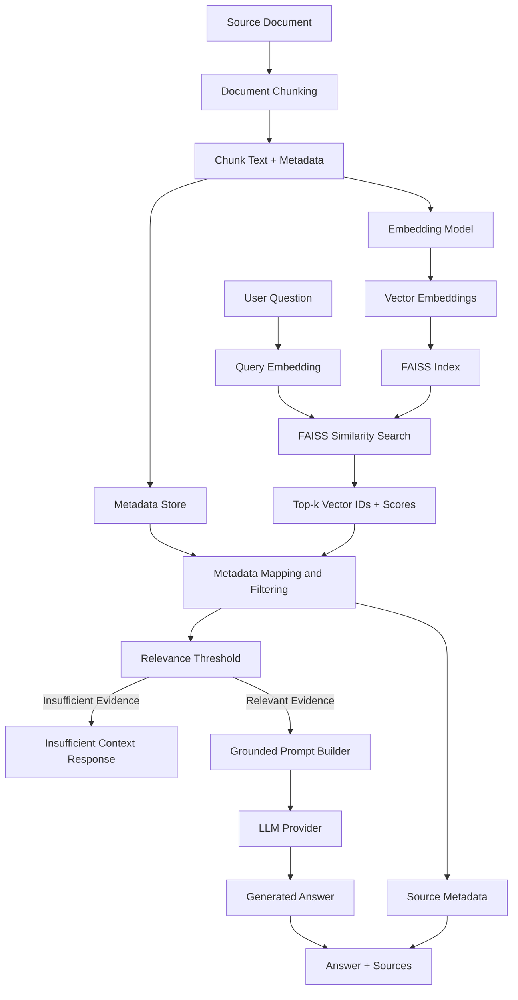
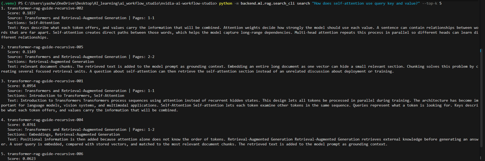
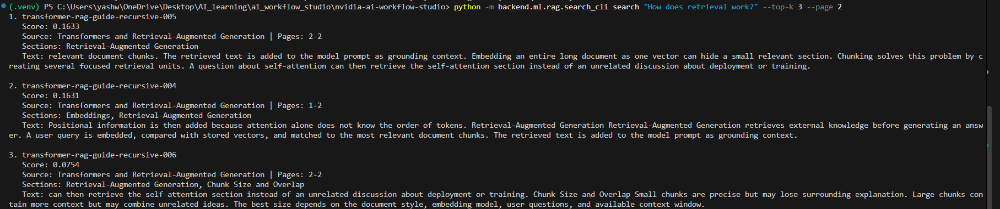
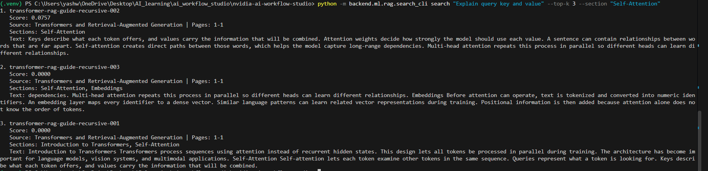
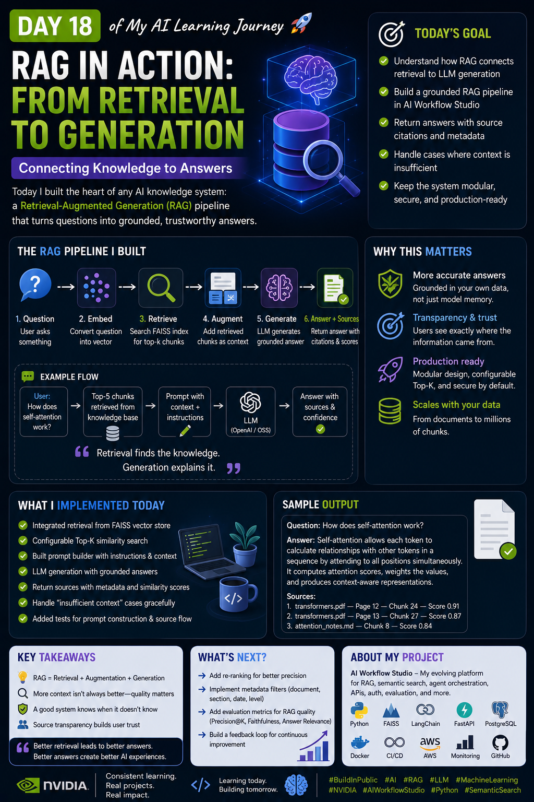

# NVIDIA AI Workflow Studio

NVIDIA AI Workflow Studio is a hands-on AI engineering project for learning how modern Retrieval-Augmented Generation (RAG) systems are designed, tested, and evolved from first principles.

The project currently implements the core path from raw document content to grounded answer generation: document chunking, metadata preservation, local embeddings, semantic retrieval, FAISS indexing, relevance filtering, prompt construction, pluggable LLM generation, and source propagation.

It is being developed as part of the **NVIDIA-Certified Associate Generative AI Large Language Models** learning track, with an emphasis on production-oriented software engineering rather than notebook-only experiments.

> **Current status:** the local RAG pipeline is implemented through grounded generation. The repository includes an offline deterministic provider for testing and an optional external LLM provider. NVIDIA NIM integration, API exposure, multi-user document ingestion, reranking, and automated RAG evaluation are planned next steps.

---

## What This Project Demonstrates

- Transformer and LLM fundamentals
- Tokenization and embedding concepts
- Semantic similarity and retrieval
- Fixed-size, sentence-based, and recursive document chunking
- Configurable chunk overlap
- Page, section, source, and chunk metadata
- FAISS vector indexing and persistence
- Exact similarity retrieval using normalized vectors
- Configurable top-k retrieval
- Metadata filtering
- Grounded prompt construction
- Relevance thresholds
- Insufficient-context handling
- Pluggable LLM-provider architecture
- Source propagation for citations
- Unit and integration testing
- Security practices for secrets and generated artifacts

---

## Current RAG Architecture



The main architectural distinction is:

```text
Retrieval    → Find relevant external evidence
Augmentation → Insert evidence into the model prompt
Generation   → Produce natural-language output
Grounding    → Tie the answer to retrieved evidence
```

Retrieval alone is not RAG.

The application becomes RAG when retrieved evidence is supplied to a generative model and the generated answer remains connected to its original sources.

---

## Learning Progression

| Day | Topic | Main Outcome |
|---|---|---|
| Day 14 | Tokenization | Understand how text becomes model-readable units |
| Day 15 | Embeddings & Semantic Search | Convert text into vectors and retrieve similar information |
| Day 16 | Document Chunking | Split large documents into focused retrieval units |
| Day 17 | FAISS Vector Store | Persist embeddings and perform efficient top-k retrieval |
| Day 18 | Grounded RAG | Connect retrieval, prompting, generation, and citations |

---

## RAG Module Structure

```text
backend/ml/rag/
├── embeddings.py
├── similarity.py
├── vector_store.py
├── semantic_search.py
│
├── metadata.py
├── chunker.py
├── recursive_chunker.py
├── chunk_visualizer.py
├── chunking_demo.py
│
├── faiss_store.py
├── metadata_store.py
├── index_builder.py
├── retriever.py
├── search_cli.py
├── benchmark_faiss.py
│
├── schemas.py
├── prompt_builder.py
├── llm_provider.py
├── rag_pipeline.py
├── demo_rag.py
│
├── README_SEMANTIC_SEARCH.md
├── README_CHUNKING.md
├── README_FAISS.md
└── README_GROUNDED_RAG.md
```

Tests include:

```text
backend/tests/
├── test_semantic_search.py
├── test_document_chunking.py
├── test_faiss_vector_store.py
├── test_prompt_builder.py
└── test_rag_pipeline.py
```

---

# End-to-End RAG Flow

A user question now travels through:

```text
Question
   ↓
Query Embedding
   ↓
FAISS Search
   ↓
Top-k Chunks
   ↓
Metadata Mapping
   ↓
Relevance Filtering
   ↓
Context Construction
   ↓
Grounded Prompt
   ↓
LLM Provider
   ↓
Generated Answer
   ↓
Answer + Sources
```

An API-friendly response can look like:

```json
{
  "answer": "Self-attention allows tokens to compare relationships [Source 1].",
  "sources": [
    {
      "rank": 1,
      "score": 0.91,
      "chunk_id": "transformer-rag-guide-recursive-002",
      "document_id": "transformer-rag-guide",
      "document_title": "Transformers and Retrieval-Augmented Generation",
      "source": "sample://transformer-rag-guide",
      "page_start": 1,
      "page_end": 1,
      "sections": [
        "Self-Attention"
      ]
    }
  ],
  "grounded": true,
  "insufficient_context": false,
  "retrieved_count": 5,
  "used_context_count": 3
}
```

---

# Grounding and Insufficient Context

The application does not blindly send every FAISS result to the LLM.

Retrieved chunks must pass a configurable relevance threshold.

```text
FAISS result
     ↓
similarity score
     ↓
score >= threshold?
   ↙              ↘
 yes               no
 ↓                  ↓
use as context    discard
```

If no useful context remains, generation is skipped.

The pipeline returns:

```text
The available sources do not contain enough information to answer this question.
```

This means an unrelated question should not cause the system to invent an answer simply because an LLM is available.

The retriever also treats an out-of-domain query that produces no known embedding features as **no retrieval result** instead of crashing the entire pipeline.

RAG does not guarantee zero hallucinations. Incorrect answers can still result from:

- poor chunk boundaries;
- weak embeddings;
- bad retrieval;
- irrelevant top-k results;
- incorrect relevance thresholds;
- stale source documents;
- prompt injection;
- model generation behavior.

This is why evaluation is part of the project roadmap.

---

# Getting Started

## Clone the Repository

```powershell
git clone https://github.com/yashwantbist/AI-WORKFLOW-STUDIO.git
cd AI-WORKFLOW-STUDIO
```

## Create a Python Virtual Environment

Windows PowerShell:

```powershell
python -m venv backend/.venv
backend/.venv/Scripts/Activate.ps1
```

## Install RAG Dependencies

```powershell
python -m pip install -r backend/ml/requirements-rag.txt
```

The RAG environment currently uses dependencies such as:

- FAISS CPU
- NumPy
- pytest

Install an optional external LLM SDK separately when needed.

---

# Build the FAISS Index

```powershell
python -m backend.ml.rag.search_cli build `
  --index-dir backend/ml/rag/artifacts/faiss `
  --index-type flat `
  --chunk-size 80 `
  --overlap 15
```

Inspect it:

```powershell
python -m backend.ml.rag.search_cli inspect
```

Conceptually:

```text
Document
   ↓
Recursive Chunker
   ↓
Chunks + Metadata
   ↓
Embeddings
   ↓
FAISS Index
```

---

# Semantic Retrieval

Run:

```powershell
python -m backend.ml.rag.search_cli search `
  "How does self-attention work?" `
  --top-k 5
```

### Filter by page

```powershell
python -m backend.ml.rag.search_cli search `
  "How does retrieval work?" `
  --top-k 3 `
  --page 2
```

### Filter by section

```powershell
python -m backend.ml.rag.search_cli search `
  "Explain query key and value" `
  --top-k 3 `
  --section "Self-Attention"
```

### Filter by document

```powershell
python -m backend.ml.rag.search_cli search `
  "How does chunking work?" `
  --top-k 3 `
  --document-id "transformer-rag-guide"
```

---

# Grounded RAG Demo

## Offline Demo

The deterministic demo provider validates the complete application flow without an external API.

```powershell
python -m backend.ml.rag.demo_rag `
  "How does self-attention work?" `
  --provider demo `
  --top-k 5 `
  --min-score 0.10
```

This exercises:

```text
Question
   ↓
Retrieval
   ↓
Context
   ↓
Prompt
   ↓
Generation Provider
   ↓
Answer + Sources
```

---

# External LLM Provider

The RAG orchestration does not depend directly on one model vendor.

Generation is accessed through an `LLMProvider` abstraction:

```text
RAGPipeline
     ↓
LLMProvider
   ↙   ↓   ↘
OpenAI NVIDIA Local model
```

This makes it possible to integrate NVIDIA NIM later without rewriting the retrieval or prompt-building layers.

Credentials must never be hard-coded.

Example PowerShell environment configuration:

```powershell
$env:OPENAI_API_KEY = "YOUR_API_KEY"
$env:OPENAI_MODEL = "YOUR_MODEL_NAME"
```

Verify without printing your API key:

```powershell
python -c "import os; print('API key loaded:', bool(os.getenv('OPENAI_API_KEY'))); print('Model:', os.getenv('OPENAI_MODEL'))"
```

Then:

```powershell
python -m backend.ml.rag.demo_rag `
  "How does self-attention work?" `
  --provider openai `
  --top-k 5 `
  --min-score 0.10
```

---

# Testing

Run the complete RAG suite:

```powershell
python -m pytest `
  backend/tests/test_semantic_search.py `
  backend/tests/test_document_chunking.py `
  backend/tests/test_faiss_vector_store.py `
  backend/tests/test_prompt_builder.py `
  backend/tests/test_rag_pipeline.py `
  -q --tb=short
```

The tests cover:

- cosine similarity;
- semantic retrieval;
- chunk sizes;
- chunk overlap;
- metadata propagation;
- FAISS indexing;
- index persistence;
- vector-to-metadata mapping;
- top-k retrieval;
- prompt construction;
- source propagation;
- relevance thresholds;
- insufficient-context behavior;
- API-friendly schemas;
- LLM-provider abstraction.

Do not assume the complete repository passes until the tests are executed in the target environment.

---

# FAISS Benchmark

The project includes a small benchmark comparing an exact NumPy vector scan with FAISS retrieval.

```powershell
python -m backend.ml.rag.search_cli benchmark `
  --vectors 10000 `
  --dimension 128 `
  --queries 100 `
  --top-k 5
```

This measures actual performance rather than assuming FAISS is always faster.

For very small datasets, NumPy may remain competitive because indexing and library-call overhead matter.

---

# Screenshots

## FAISS Semantic Retrieval



## Metadata Filtering





## RAG Learning Progression



---

# Documentation

## RAG Engineering

| Document | Purpose |
|---|---|
| [Semantic Search](backend/ml/rag/README_SEMANTIC_SEARCH.md) | Embeddings, similarity, and retrieval |
| [Document Chunking](backend/ml/rag/README_CHUNKING.md) | Chunking strategies, overlap, and metadata |
| [FAISS Vector Store](backend/ml/rag/README_FAISS.md) | Indexing, persistence, filtering, and benchmarking |
| [Grounded RAG](backend/ml/rag/README_GROUNDED_RAG.md) | Retrieval-to-generation architecture and grounding |

## Responsible AI

| Document | Purpose |
|---|---|
| [System Card](docs/system-card.md) | Capabilities, limitations, and safety considerations |
| [AI Risk Register](docs/ai-risk-register.md) | Risks, mitigations, and test criteria |
| [Data Handling Policy](docs/data-handling-policy.md) | Data storage, access, collection, and deletion principles |
| [Threat Model](docs/threat-model.md) | Assets, entry points, trust boundaries, and abuse scenarios |

---

# Security

Never commit:

- `.env` files;
- OpenAI API keys;
- NVIDIA API keys;
- AWS credentials;
- Stripe secrets;
- SSH private keys;
- authentication tokens;
- private uploaded documents;
- generated vector indexes containing sensitive information.

Inspect changes before pushing:

```powershell
git status --short
git diff
git diff --cached --name-only
```

Search staged repository content for common credential patterns:

```powershell
git grep -n -I -E "(API_KEY|SECRET|PASSWORD|ACCESS_KEY|PRIVATE_KEY)"
```

The repository `.gitignore` excludes environment files, Python environments, caches, common local vector database paths, uploaded files, and user-data directories.

---

# Current Limitations

This project is not yet a production multi-tenant RAG service.

Current limitations include:

- the educational embedding implementation is currently TF-IDF-based rather than a production neural embedding model;
- the current knowledge base is intentionally small;
- FAISS metadata filtering is implemented at the application layer;
- arbitrary PDF ingestion is not yet exposed as a production API;
- reranking has not yet been implemented;
- hybrid lexical + semantic search is not yet implemented;
- retrieval quality is not yet evaluated automatically;
- answer faithfulness is not yet scored automatically;
- authentication and multi-user document authorization are future platform work;
- external LLM generation depends on provider credentials and availability.

---

# Roadmap

## Retrieval Quality

- Neural embedding model
- NVIDIA embedding integration
- Hybrid BM25 + semantic retrieval
- Candidate reranking
- Retrieval recall evaluation
- Duplicate-context reduction

## RAG Evaluation

- Faithfulness scoring
- Citation correctness
- Context relevance metrics
- Retrieval precision and recall
- Adversarial queries
- Hallucination evaluation
- Regression datasets

## Grounded Generation

- Token-aware context budgets
- Better citation formatting
- Prompt-injection defenses
- Conversation history
- Source verification
- Structured generation

## Backend Platform

- FastAPI RAG endpoint
- PDF upload
- Document parsing
- Background ingestion
- Authentication
- Authorization
- Per-user document isolation
- Multi-tenant metadata filtering

## Infrastructure

- Docker
- CI/CD
- Cloud deployment
- Observability
- Logging
- RAG latency monitoring
- Retrieval performance monitoring

## NVIDIA Integration

- NVIDIA NIM LLM provider
- NVIDIA embedding model
- GPU inference experiments
- GPU-accelerated FAISS experiments
- CPU vs GPU benchmark comparison

---

# Project Goal

The long-term goal is to evolve NVIDIA AI Workflow Studio from individual machine-learning exercises into a production-oriented knowledge assistant while keeping every layer understandable, testable, and replaceable.

Instead of hiding the RAG system behind a framework, this project intentionally exposes the mechanics:

```text
Text
 ↓
Chunks
 ↓
Embeddings
 ↓
Vectors
 ↓
FAISS
 ↓
Retrieval
 ↓
Grounded Prompt
 ↓
LLM
 ↓
Answer + Sources
```

This makes the repository both a learning environment and a portfolio demonstration of practical AI engineering, Retrieval-Augmented Generation, testing, security awareness, and software-design fundamentals.
