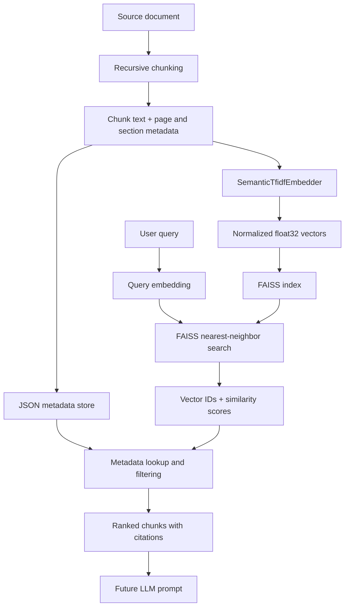

# Day 16: FAISS Vector Store and Retrieval Pipeline

This feature extends the existing semantic-search and document-chunking work
with a persistent FAISS index, metadata mapping, configurable top-k retrieval,
metadata filters, exact and approximate index options, a CLI, and a benchmark.

## Retrieval pipeline



## Install

The project uses the CPU build because it works locally without CUDA:

```powershell
python -m pip install faiss-cpu==1.15.0 numpy
```

Verify:

```powershell
python -c "import faiss, numpy; print(faiss.__version__)"
```

## Why normalized IndexFlatIP?

Cosine similarity compares vector direction. When document and query vectors
are L2-normalized, their inner product equals cosine similarity.

The default index is `IndexFlatIP`:

- exact, not approximate;
- simple to understand;
- useful as a correctness baseline;
- appropriate for a small educational knowledge base.

The CLI also supports HNSW:

```powershell
python -m backend.ml.rag.search_cli build `
  --index-type hnsw `
  --hnsw-m 32 `
  --ef-construction 80 `
  --ef-search 64
```

HNSW is approximate. It trades some recall for faster retrieval on larger
collections.

## Files

- `faiss_store.py`: safe FAISS wrapper, normalization, exact/HNSW indexes, persistence.
- `metadata_store.py`: vector-ID-to-chunk mapping and filters.
- `index_builder.py`: chunk → embedding → FAISS build pipeline.
- `retriever.py`: query embedding, nearest-neighbor search, metadata results.
- `search_cli.py`: build, search, inspect, and benchmark commands.
- `benchmark_faiss.py`: NumPy list scan versus FAISS flat search.
- `test_faiss_vector_store.py`: unit, persistence, retrieval, and mapping tests.

## Build the index

From the repository root:

```powershell
python -m backend.ml.rag.search_cli build `
  --index-dir backend/ml/rag/artifacts/faiss `
  --index-type flat `
  --chunk-size 80 `
  --overlap 15
```

Generated files:

```text
backend/ml/rag/artifacts/faiss/
├── chunks.faiss
├── chunks.metadata.json
└── chunks.manifest.json
```

The native FAISS index stores vectors. The JSON metadata file stores source
text, document ID, page range, sections, strategy, and chunking offsets. Their
positions must remain aligned: FAISS vector ID `3` maps to metadata record `3`.

## Search

```powershell
python -m backend.ml.rag.search_cli search `
  "Why does overlap help chunk boundaries?" `
  --top-k 5
```

Filter by page:

```powershell
python -m backend.ml.rag.search_cli search `
  "How are sources cited?" `
  --top-k 3 `
  --page 2
```

Filter by section text:

```powershell
python -m backend.ml.rag.search_cli search `
  "Explain query key and value" `
  --section "Self-Attention"
```

For this learning implementation, metadata filtering is performed after FAISS
returns candidates. When filters are present, the retriever requests all local
candidates, applies the filter, then returns the first `k` matches. Production
systems may use a vector database with native pre-filtering or separate indexes.

## Save and reload

`faiss.write_index()` stores the native index. `faiss.read_index()` reloads it.
The embedding model is rebuilt deterministically from the stored chunk text so
queries use the same feature space after restart.

## Benchmark

```powershell
python -m backend.ml.rag.search_cli benchmark `
  --vectors 10000 `
  --dimension 128 `
  --queries 100 `
  --top-k 5
```

The benchmark compares:

1. NumPy matrix multiplication followed by top-k sorting;
2. FAISS `IndexFlatIP` exact search.

Because both methods are exact, top-1 agreement should be 100%. On very small
collections, NumPy may be competitive or even faster because setup overhead is
significant. FAISS becomes more useful as vector counts, query volume, and index
complexity grow. Record results from your own machine instead of assuming a
speedup.

| Machine | Vectors | Dimensions | Queries | NumPy | FAISS | Speedup |
|---|---:|---:|---:|---:|---:|---:|
| Your Windows PC | 10,000 | 128 | 100 | Run benchmark | Run benchmark | Calculate |

## Exact search versus ANN

| Approach | Search behavior | Accuracy | Typical use |
|---|---|---|---|
| Python loop/list | Compare every vector in Python | Exact | Tiny demos |
| NumPy matrix scan | Compare every vector in optimized native code | Exact | Baseline |
| FAISS Flat | Compare every vector using FAISS | Exact | Baseline and small/medium indexes |
| FAISS HNSW | Navigate a proximity graph | Approximate | Larger low-latency systems |
| FAISS IVF/PQ | Search selected partitions and compressed vectors | Approximate | Very large collections |

## Metadata schema

```json
{
  "chunk_id": "transformer-rag-guide-recursive-003",
  "text": "Self-attention lets each token examine...",
  "document_id": "transformer-rag-guide",
  "document_title": "Transformers and Retrieval-Augmented Generation",
  "source": "sample://transformer-rag-guide",
  "page_start": 1,
  "page_end": 1,
  "sections": ["Self-Attention"],
  "strategy": "recursive",
  "extra": {
    "chunk_index": 3,
    "word_count": 75,
    "overlap_words": 15
  }
}
```

## Tests

Install FAISS first, then run:

```powershell
python -m pytest backend/tests/test_faiss_vector_store.py -v
```

The tests include a dependency-injected FAISS-compatible fake for deterministic
wrapper tests plus an optional real-FAISS integration test. When `faiss-cpu` is
installed, the native integration test runs automatically.

Then run the complete RAG suite:

```powershell
python -m pytest backend/tests/test_semantic_search.py `
  backend/tests/test_document_chunking.py `
  backend/tests/test_faiss_vector_store.py -q --tb=short
```

## Design decisions

### Sequential vector IDs

Flat indexes assign IDs in insertion order. The metadata store deliberately uses
the same ordering. The builder checks this invariant before saving.

### Float32 vectors

FAISS expects two-dimensional `float32` matrices. The wrapper validates shape,
dimension, finiteness, and zero-vector handling before calling the native API.

### Dependency injection

`FaissVectorStore` accepts a `faiss_module` argument. Production code uses the
real package. Tests can inject a deterministic fake without changing runtime
logic.

### Rebuildable embeddings

The current educational embedder is fitted from stored chunk text when loading.
A future neural embedding provider should store its model name, version, output
dimension, and normalization policy in the manifest.

## Security and generated artifacts

No API key is required for this local feature. Generated indexes should not be
committed because they can be rebuilt and may eventually contain private source
content.

The included nested `.gitignore` keeps generated FAISS artifacts out of Git:

```text
backend/ml/rag/artifacts/faiss/*
```

Before committing:

```powershell
git status --short
git diff --cached --name-only
git grep -n -I -E "(API_KEY|SECRET|PASSWORD|ACCESS_KEY|PRIVATE_KEY)"
```

Never commit `.env` files, OpenAI or NVIDIA keys, AWS credentials, Stripe
secrets, or SSH private keys.

## Next improvements

- Replace TF-IDF with a neural embedding model.
- Add hybrid BM25 plus vector search.
- Add native metadata pre-filtering through a production vector database.
- Evaluate HNSW recall against the flat exact baseline.
- Add incremental updates and deleted-document handling.
- Expose retrieval through FastAPI.
- Add reranking and grounded answer generation.
