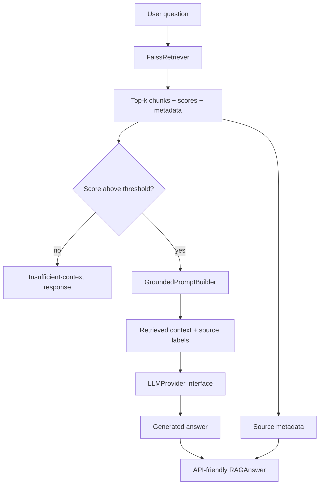

# Day 18 — Grounded Retrieval-Augmented Generation

Day 17 ended at retrieval:

```text
question -> query embedding -> FAISS -> ranked chunks + metadata
```

Day 18 adds augmentation and generation:



## Four core ideas

**Retrieval** selects potentially relevant evidence from external data.

**Augmentation** adds that evidence to the model input with source labels.

**Generation** converts the grounded prompt into natural-language output.

**Grounding** means the answer should be supported by retrieved evidence.

RAG reduces unsupported answers but cannot guarantee zero hallucinations.

## Files

```text
backend/ml/rag/
├── schemas.py
├── prompt_builder.py
├── llm_provider.py
├── rag_pipeline.py
├── demo_rag.py
└── README_GROUNDED_RAG.md

backend/tests/
├── test_prompt_builder.py
└── test_rag_pipeline.py
```

The implementation reuses the existing Day 17 `FaissRetriever` rather than
reimplementing retrieval.

## API-friendly response

```json
{
  "answer": "Self-attention lets tokens compare relationships [Source 1].",
  "sources": [
    {
      "rank": 1,
      "score": 0.91,
      "chunk_id": "transformer-rag-guide-recursive-002",
      "document_id": "transformer-rag-guide",
      "document_title": "Transformers and Retrieval-Augmented Generation",
      "source": "sample://transformer-rag-guide",
      "page_start": 1,
      "page_end": 1,
      "sections": ["Self-Attention"]
    }
  ],
  "grounded": true,
  "insufficient_context": false,
  "retrieved_count": 5,
  "used_context_count": 3
}
```

## Insufficient context

The pipeline applies a configurable `minimum_relevance_score` before calling
the LLM. If no result clears the threshold, generation is skipped and the
pipeline returns:

```text
The available sources do not contain enough information to answer this question.
```

A production threshold should be selected through evaluation; `0.10` is a
learning default, not a universal answer.

## Why top-k=50 is not automatically better

More retrieved text can add irrelevant or duplicate chunks, consume the model
context window, increase latency/cost, and distract the generator. Start with a
small top-k such as 3–5 and evaluate on representative questions.

## Offline validation

Build Day 17 first if needed:

```powershell
python -m backend.ml.rag.search_cli build
```

Then run the complete RAG flow with a deterministic provider:

```powershell
python -m backend.ml.rag.demo_rag `
  "How does self-attention work?" `
  --provider demo `
  --top-k 5
```

The demo provider is not a real LLM. It exists so retrieval, augmentation,
source propagation, and failure behavior can be tested without credentials.

## Real OpenAI generation

Install the current OpenAI SDK:

```powershell
python -m pip install -U openai
```

Keep credentials in environment variables, never source code:

```text
OPENAI_API_KEY
OPENAI_MODEL
```

Run:

```powershell
python -m backend.ml.rag.demo_rag `
  "How does self-attention work?" `
  --provider openai `
  --top-k 5 `
  --min-score 0.10
```

The provider calls the Responses API through `client.responses.create(...)` and
reads `response.output_text`.

## Prompt injection note

Retrieved documents are untrusted data. A malicious chunk could contain text
such as "ignore previous instructions." Production systems should use source
permissions, treat retrieved text as data rather than instructions, evaluate
prompt injection, and avoid giving the generator unnecessary tools.

## Tests

```powershell
python -m pytest `
  backend/tests/test_prompt_builder.py `
  backend/tests/test_rag_pipeline.py `
  -v
```

The tests verify prompt construction, source metadata, top-k forwarding,
insufficient-context behavior, source propagation, serialization, and the
provider interface.

## Exam notes

### Retrieval vs generation

Retrieval selects external evidence. Generation writes an answer using the
question plus that evidence.

### Two ways RAG can still hallucinate

1. retrieval returns irrelevant or incomplete evidence;
2. the LLM misreads the context or extrapolates beyond it.

Other causes include bad chunking, weak embeddings, stale documents, prompt
injection, and poorly calibrated thresholds.

### What if evidence is insufficient?

Do not fabricate. Return an explicit insufficient-evidence answer and avoid an
LLM call when possible.

## Security check

Before committing:

```powershell
git status --short
git diff
git diff --cached --name-only
git grep -n -I -E "(API_KEY|SECRET|PASSWORD|ACCESS_KEY|PRIVATE_KEY)"
```

Never commit `.env`, API keys, cloud credentials, payment secrets, SSH private
keys, or private source documents inside generated vector indexes.

## Next improvements

1. neural embedding model;
2. hybrid BM25 + vector retrieval;
3. reranking before prompt construction;
4. token-aware context budgeting;
5. FastAPI endpoint around `RAGPipeline.answer()`;
6. retrieval/citation/faithfulness evaluation;
7. document permissions and tenant filters.
