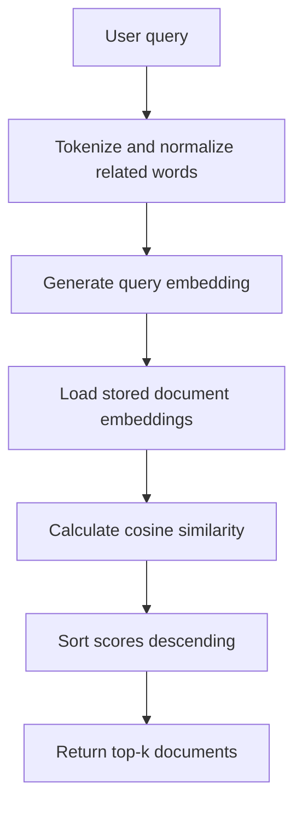

# Day 15 — Embeddings and Semantic Search

## Measurable objective

By the end of this lab, you can explain how text becomes a vector, calculate
cosine similarity, store document vectors in memory, and retrieve the top-k
most relevant documents for a natural-language query.

## Important design note

This project uses a **local concept-aware TF-IDF embedder**. It is deterministic,
inspectable, free to run, and requires no API key or model download. It maps a
small set of related words to shared concepts, then builds TF-IDF vectors.

It is not a replacement for a production neural embedding model. In a real RAG
system, `SemanticTfidfEmbedder` can be replaced by a hosted or local neural
embedding model while the storage, cosine-similarity, top-k ranking, and CLI
pipeline remain conceptually similar.

## Project structure

```text
backend/ml/rag/
├── __init__.py
├── embeddings.py
├── vector_store.py
├── semantic_search.py
├── similarity.py
├── sample_documents.py
├── README_SEMANTIC_SEARCH.md
└── LINE_BY_LINE_GUIDE.md

backend/tests/
└── test_semantic_search.py
```

## Retrieval pipeline

```text
User query
    │
    ▼
Tokenize and normalize related words
    │
    ▼
Generate query TF-IDF embedding
    │
    ▼
Compare query vector with stored document vectors
    │
    ▼
Calculate cosine similarity for every document
    │
    ▼
Sort from highest score to lowest score
    │
    ▼
Return the top-k documents
```

GitHub also renders this Mermaid version:



## How an embedding is created

For this educational implementation:

1. Text is lowercased and split into tokens.
2. Common stop words such as `the` and `how` are removed.
3. Related words are mapped to one concept. For example, `find`, `search`, and
   `retrieve` become `retrieval`.
4. Unigram and bigram features are extracted.
5. TF-IDF gives more weight to useful, less-common features.
6. The vector is normalized to length 1.

A document such as `Search retrieves related documents` may therefore become a
vector like:

```text
[0.0, 0.41, 0.0, 0.58, 0.0, 0.71, ...]
```

The values and dimensions are learned from the sample knowledge base.

## Install and test

From the repository root with the virtual environment activated:

```powershell
python -m pip install -r backend/ml/requirements-ml.txt
python -m pytest backend/tests/test_semantic_search.py -v
```

No additional packages are required.

## Run semantic search

```powershell
python -m backend.ml.rag.semantic_search `
  "How does attention work?" `
  --top-k 5
```

Show the query vector:

```powershell
python -m backend.ml.rag.semantic_search `
  "How can I deploy software using containers in the cloud?" `
  --top-k 3 `
  --show-vector
```

List all knowledge-base documents:

```powershell
python -m backend.ml.rag.semantic_search --list-documents
```

Direct script execution is also supported:

```powershell
python backend/ml/rag/semantic_search.py "What are text vectors?"
```

## Example queries and expected leading result

| Query | Expected leading document | Why |
|---|---|---|
| `How does attention work?` | Self-Attention in Transformers | Both contain the attention concept. |
| `How can I deploy software using containers?` | Containerized ML Deployment | `deploy`, `containers`, and `cloud` normalize to deployment concepts. |
| `How do I find meaningful documents?` | Retrieval-Augmented Generation or Vector Stores | `find` maps to retrieval and `meaningful` maps to semantic. |
| `How are text vectors compared?` | Cosine Similarity | The document discusses comparing vector directions. |
| `How do models learn from loss?` | Neural Network Training | The query shares training and loss concepts. |

Exact lower-ranked results may change when the knowledge base or synonym groups
change. Tests assert only stable, important ranking behavior.

## In-memory vector-store decisions

### Why RAM storage?

The knowledge base contains only ten short documents. A Python tuple is enough,
keeps the code easy to inspect, and avoids a database dependency.

### Why precompute document embeddings?

Documents do not change during one run. Their vectors are calculated once when
added to the store. Every query only needs one new embedding plus similarity
comparisons.

### Why exhaustive search?

The store compares the query against every document. This is exact and simple.
For millions of documents, production systems use approximate nearest-neighbor
indexes such as HNSW or IVF to reduce search time.

### Why deterministic sorting?

Results are sorted by descending score and then by document ID. The secondary
key makes tied results repeatable and tests reliable.

### Current limitations

- The semantic synonym map is intentionally small and hand-authored.
- Unknown query features produce zero-valued dimensions.
- The vocabulary is rebuilt when documents are replaced.
- Data is not persisted after the process exits.
- There are no metadata filters or access controls.
- It does not use a neural language model.

## Keyword search versus semantic search

| Query | Keyword search behavior | Semantic search behavior |
|---|---|---|
| `find meaningful documents` | May miss text containing `retrieve relevant knowledge` because the exact words differ. | Normalizes `find` to retrieval and `meaningful` to semantic/relevance concepts. |
| `ship software in containers` | May require the document to contain `ship`. | Can connect container-related language with Docker and deployment concepts. |
| `text represented as numbers` | May miss documents containing only `embedding` and `vector`. | Can map representation and vector terms into the embedding concept. |

## Security and Git hygiene

The repository `.gitignore` should exclude:

```text
.env
*.env
.venv/
*.pt
*.pth
chroma_db/
faiss_index/
uploads/
user_data/
```

Never commit API keys, cloud credentials, private documents, local vector
databases, model checkpoints, or user-uploaded data.

Before committing:

```powershell
git status --short
git diff --cached --name-only
git grep -n -I -E "(API_KEY|SECRET|PASSWORD|TOKEN)" -- . ":(exclude).env*"
```

Review matches manually because words such as `token` can appear in normal ML
source code.

## Definition of done

- [x] Documents are converted into numeric embeddings.
- [x] Embeddings are stored in memory.
- [x] Cosine similarity is calculated.
- [x] Top-k retrieval returns ranked results.
- [x] A command-line search interface is available.
- [x] A small sample knowledge base is included.
- [x] Unit tests validate similarity and ranking.
- [x] The README documents the pipeline and design decisions.
- [x] Secrets and local vector artifacts are excluded by `.gitignore`.

## Git workflow

```powershell
git switch main
git pull --ff-only origin main
git switch -c feature/semantic-search

python -m pytest backend/tests/test_semantic_search.py -v

git add backend/ml/rag backend/tests/test_semantic_search.py
git diff --cached --stat
git commit -m "feat(rag): implement semantic search with embedding retrieval"
git push -u origin HEAD
```
